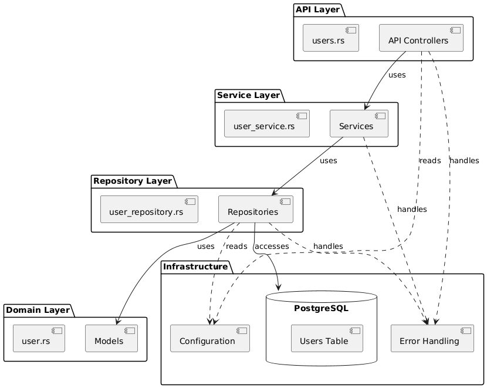
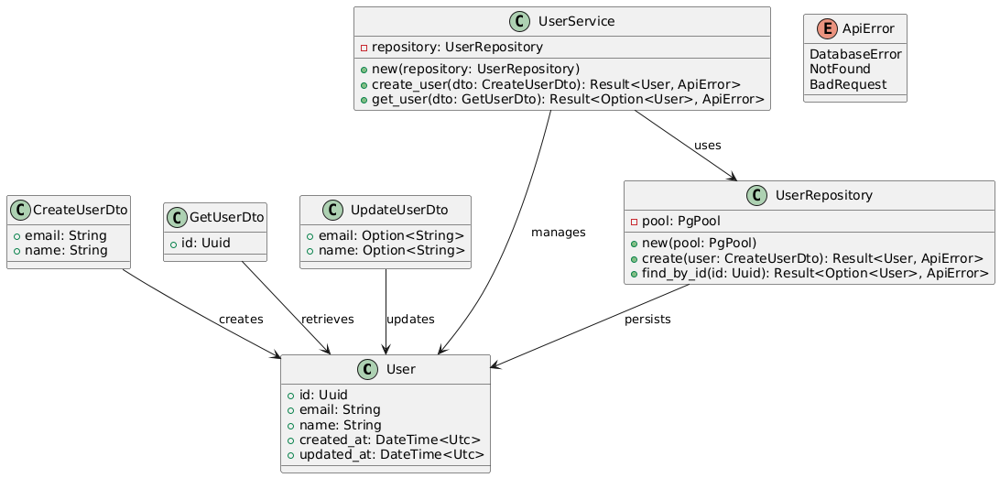
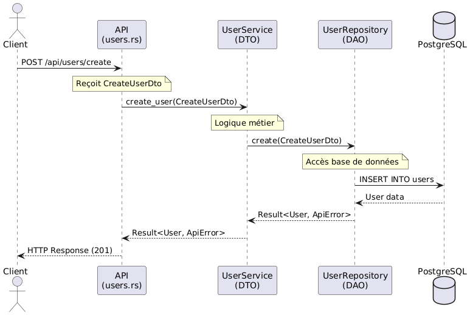

# Rust Rest API

A modern REST API boilerplate built with Rust, implementing clean architecture principles. This project demonstrates a well-structured application using Actix-web, SQLx, and PostgreSQL.

<p align="center">
  
</p>

## 🏗️ Architecture

```
src/
├── api/
│   ├── mod.rs
│   └── users.rs
├── models/
│   ├── mod.rs
│   └── user.rs
├── repositories/
│   ├── mod.rs
│   └── user_repository.rs
├── services/
│   ├── mod.rs
│   └── user_service.rs
├── config.rs
├── error.rs
└── main.rs
```

## Class Diagram

<p align="center">
  
</p>


## Sequence Diagram

<p align="center">
  
</p>
# rust-mailer-saas
